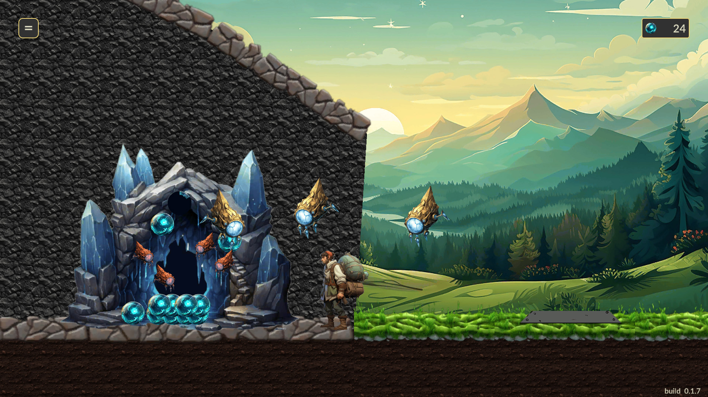

# Hamlet Two Sacks

## Description
An automation-focused, side-scrolling micro strategy game set in a magitech-inspired world.  
Players aim to construct and automate a system for extracting and delivering magical crystals.  
The project draws significant inspiration from the minimalist design of the game [Kingdom Two Crowns](https://store.steampowered.com/app/701160/Kingdom_Two_Crowns/).

### Theme - Delivery
For the sake of simplicity I took the Ludum Dare 53 theme

### Goals
- Complete the project as quickly as possible.
- Adhere to the theme.
- Enhance my skills in project completion.
- Evaluate the utility of my "core" codebase and further develop it within the context of a real project.

### How to run
- Unity version 2022.3.8f1 lts
- Run from "bootstrap" scene

### Project structure
 - Zenject as DI framework
 - GameStarter as project entry point
 - Scenes structure:
     - bootstrap scene (project loading + project wide funtionality)
     - level scene (loaded when needed)
     - ui scene
 
## Acknowledgements
1. Extenject
     - Project URL: https://github.com/Mathijs-Bakker/Extenject
     - Description: Lightweight highly performant dependency injection framework built specifically to target Unity 3D 
    
2. UniRx - Reactive Extensions for Unity
     - Project URL: https://github.com/neuecc/UniRx
     - Description: Reimplementation of the .NET Reactive Extensions, designed to be compatible with iOS IL2CPP
     
3. DOTween
     - Project URL: http://dotween.demigiant.com
     - Description: Fast, efficient, fully type-safe object-oriented animation engine for Unity
 
4. UniTask
     - Project URL: https://github.com/Cysharp/UniTask
     - Description: Efficient allocation free async/await integration for Unity
